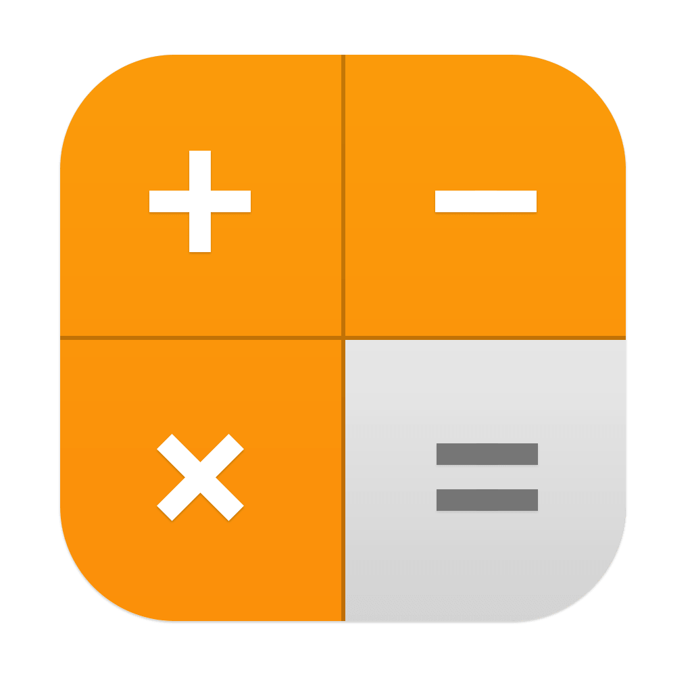
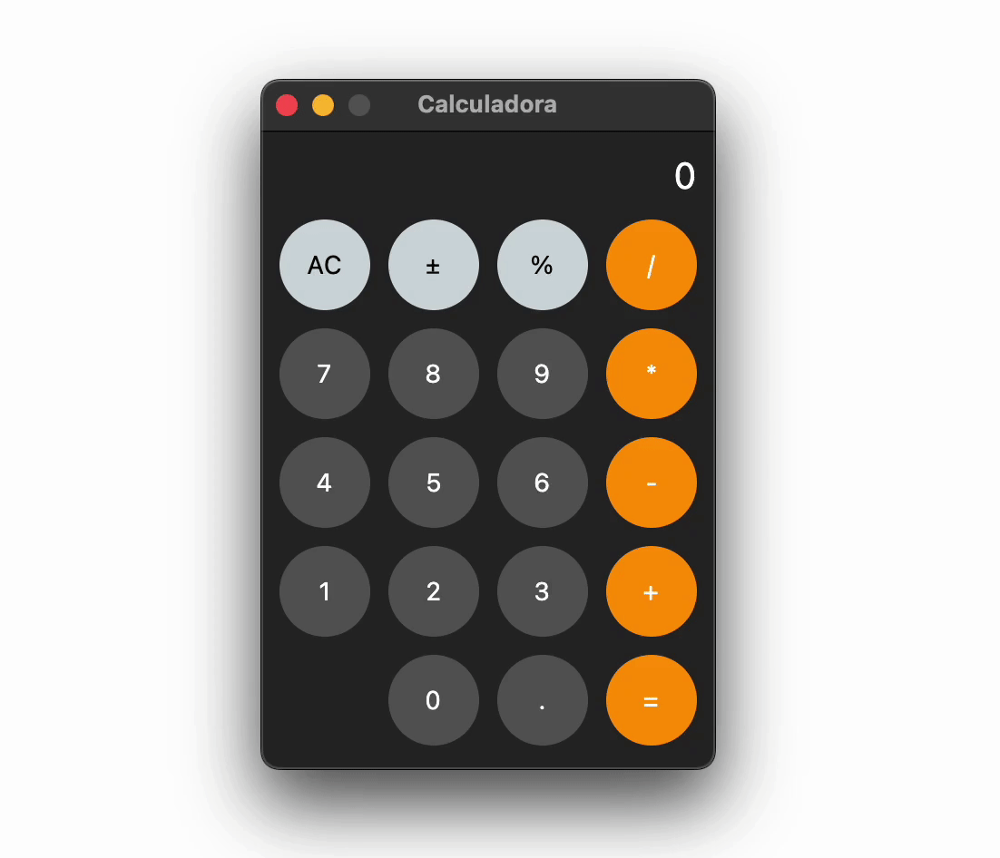

<div style="text-align:center"></div>

# Calculadora do iPhone



## Descrição do Projeto

Esta é uma implementação de uma calculadora inspirada na calculadora do iPhone. O projeto foi desenvolvido em Python usando a biblioteca Flet para a interface gráfica.

## Índice

- [Instalação](#instalação)
- [Uso](#uso)
- [Contribuição](#contribuição)
- [Licença](#licença)
- [Status do Projeto](#status-do-projeto)
- [Contato](#contato)

## Instalação

Para executar a Calculadora do iPhone, siga os passos abaixo:

1. Ative o ambiente virtual (recomendado):

   ```bash
   source venv/bin/activate
   ```

2. Instale as dependências do projeto:

   ```bash
   pip install -r requirements.txt
   ```

3. Execute o arquivo principal `calculadora.py`:

   ```bash
   python calculadora.py
   ```

## Uso

A Calculadora do iPhone oferece uma interface simples e familiar. Você pode realizar operações de adição, subtração, multiplicação e divisão, bem como cálculos percentuais e alterar o sinal dos números. Os resultados são exibidos na tela central.

## Contribuição

Sinta-se à vontade para contribuir com este projeto. Se você encontrou um bug, tem uma sugestão ou deseja colaborar de alguma forma, siga estas diretrizes:

- Abra um problema (issue) para discutir a alteração ou problema.
- Faça um fork do projeto.
- Crie um branch com uma descrição significativa (por exemplo, `feature-nova-funcionalidade` ou `correcao-nome-do-bug`).
- Envie suas alterações em um pull request.

### Contato

Para mais informações ou dúvidas sobre o projeto, entre em contato pelo e-mail: [contato@programadoraventureiro.com](mailto:contato@programadoraventureiro.com)

## Licença

Este projeto está licenciado sob a Licença Pública Geral GNU (GPL) - consulte o arquivo [LICENSE](LICENSE) para obter detalhes.